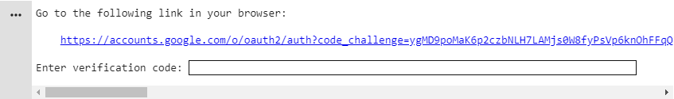
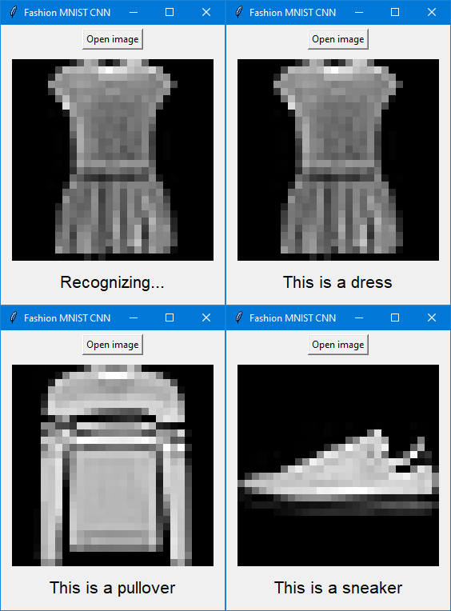

# Fashion-MNIST-CNN
The project uses convolutional neural network to recognize clothes using Fashion MNIST dataset.
Images can be loaded and recognized by using a simple user interface.

## Authors

* **Agnieszka Ganowicz**
* **Pawel Cembaluk**
* **Bartosz Starosta**

## Built with
* [Google Colab](https://colab.research.google.com/)
* [JetBrains PyCharm](https://www.jetbrains.com/pycharm/)
* [Sourcetree](https://www.sourcetreeapp.com/)

## Usage

### Google Colab model
To train the model use provided
[Google Colab notebook](https://colab.research.google.com/drive/1ogtoxgSlonon7fVNfXYCiXYKjmfzeFLY?usp=sharing).
First make a copy of notebook by clicking _File → Save a copy..._ or switch to playground mode by clicking
_Open in playground_. Then choose _Runtime → Run all_ or press _Ctrl + F9_. After training the model can 
be saved on your Google Drive by clicking on link in the last cell and pasting the verification code.



### UI
The project uses Conda package manager. To create the environment follow the steps below using 
the Anaconda Prompt:

1. Create the Conda environment

   ```
   conda env create -f path/to/environment.yml
   ```
   
2. Activate the environment

   ```
   conda activate Fashion-MNIST-CNN
   ```

After activating the environment just run _/UI/**UserInterface.py**_. You can swap the model to your own
by changing _model.pth_ in _Data_ folder.

## Screenshots
